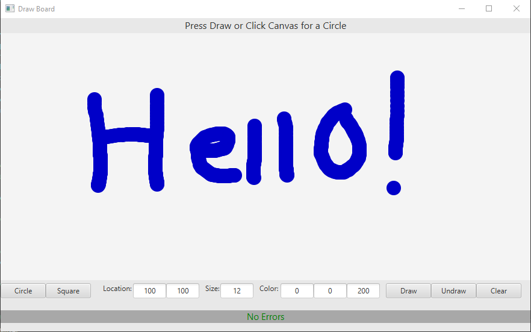
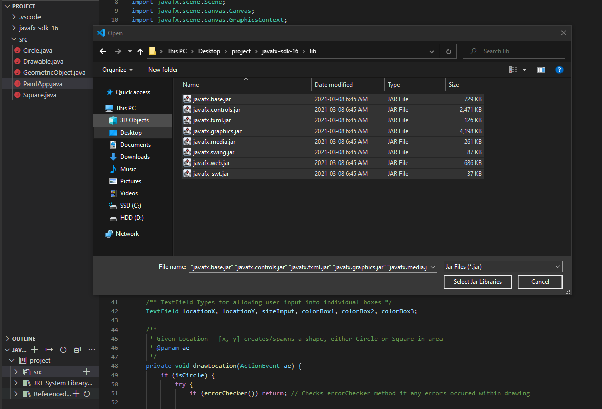
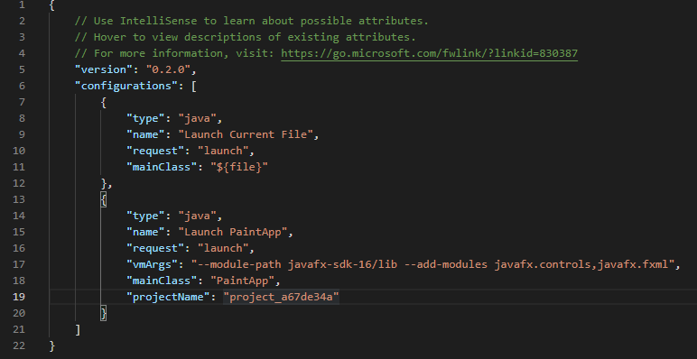

# Paint-Application
A Simple Paint-Application written in Java utilizing the JavaFX Graphics Template

<JavaFX Setup>
[1] Download the JavaFX Graphics Template (javafx-sdk-16) : https://gluonhq.com/products/javafx/

[2] Place it in the same folder as 'src' is in

[3] In Visual Studio Code, click the dropdown of "Java Projects" at the bottom left, hover over "Referenced Libraries" and click the plus (+)

[4] As File Explorer pops up, direct yourself to javafx-sdk-16\lib, hover and select all of the Jar Files

<Visual Studio Code Setup - JavaFX Link>
  
[!] Inside the .vscode folder, paste this under the request tab : "vmArgs": "--module-path javafx-sdk-16/lib --add-modules javafx.controls,javafx.fxml",

